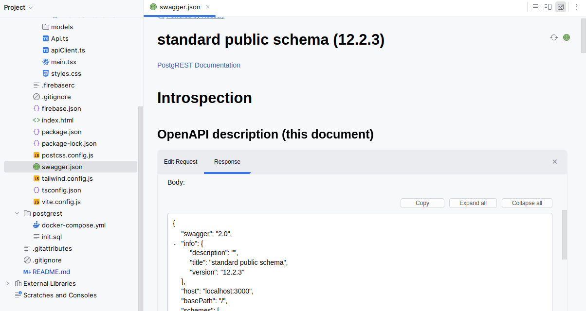

# Assignment: The Hospital App

# Rules

- You may help each other, but I recommend solving the assignment on your own
- It is not an assignment you have to "submit", but we have "product showcases" next Monday just before we start building server applications with C#.
- It is not mandatory to show your application, but I strongly recommend to do so: It can be a great learning opportunity to present your work to stakeholder/colleagues (and flex on others).
- The student with my favorite implementation gets a 🎁mystery prize🎁 (only students who do a showcase will be eligible to enter competition)

## Starting point:

You can clone this recommended startup boilerplate including the backend program neede like this:

```bash
git clone https://github.com/uldahlalex/react-assignment
```
The "client" folder contains relevant dependencies and configuration for the frontend. 
You are also free to build the client app completely from scratch if you prefer.

## How to start the backend
Have docker daemon running (you can check if you get an error when running 'docker ps' ).
From the "postgrest" directory in this project, run:
```bash
docker compose up
```

**All "client" commands like npm install, npm run dev, etc should be executed inside the "client" directory**

I have made a swagger.json file (in the "client" directory) which documents the API running on port 3000 when using docker compose up.

You can either open it with Webstorm and it will look like this:
 

(Notice the buttons in the top right corner to see json / visual representation). 
But for many Webstorm doesn't allow for sending HTTP requests, so I recommend copying the file contents from swagger.json and pasting into https://editor.swagger.io/
It might ask if you want to convert to YAML. Just say yes, and you should have the Hospital API swagger page in your browser like this:


The "npm run scaffold" command from the client directory also uses this swagger.json file to generate the API Client code.

You can also choose to use fetch() as an HTTP client and make your own models / generate them using https://transform.tools/json-to-typescript if you prefer.

You can also open up the Postgres Database manually using Datagrip / whatever other Database browser if you would like to. 
It runs on localhost:5432 and requires the credentials listed in docker-compose.yml (username "testuser" password "testpass" and databasename "testdb")

### How to reset data in backend

If you have made some changes in the database data, and you want to "go back" to the starting point, you can use:

(from the "postgrest" directory):
```bash
docker-compose down
docker volume rm postgrest_dbdata
docker-compose up
```

# Requirements

## Minimum requirements (FULL crud for single entity):
- It should be possible to get an overview of all patients when navigating to /patients
- It should be possible to get all data for a singular patient when navigating to /patients/:id where ID is the patient ID
- It should be possible to enroll a new patient (create)
- It should be possible to delete a patient
- It should be possible to update a patient
- The client application should be deployed to Firebase. If the backend is running locally, opening the deployment locally should still work.

## Bonus requirements
- It should be possible to create a new disease which patients may be diagnosed with
- It should be possible to add a new diagnosis to a patient
- It should be possible to add new diseases

## Hard bonus requirements
- In the patients feed overview (all patients), a number next to the patient name should indicate the number of diagnosis for the patient (hint: It's possible to "join" tables when querying postgREST)
- The overview of patients should be paginated such that the page only shows the first X patients
- It should be possible to search for patients and diseases
- Whatever other feature you think will be cool to have!


## Relevant documentation for using the backend:
The backend is built with postgREST which is a REST tool on top of a PostgreSQL database.
The reference API for querying the "tables" can be found here: https://docs.postgrest.org/en/v12/references/api/tables_views.html
